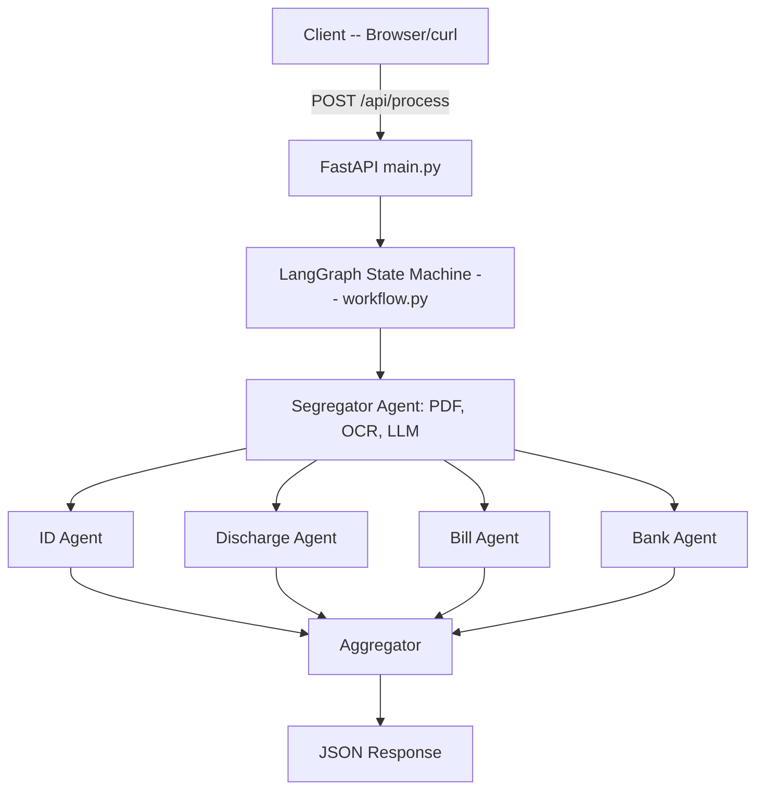
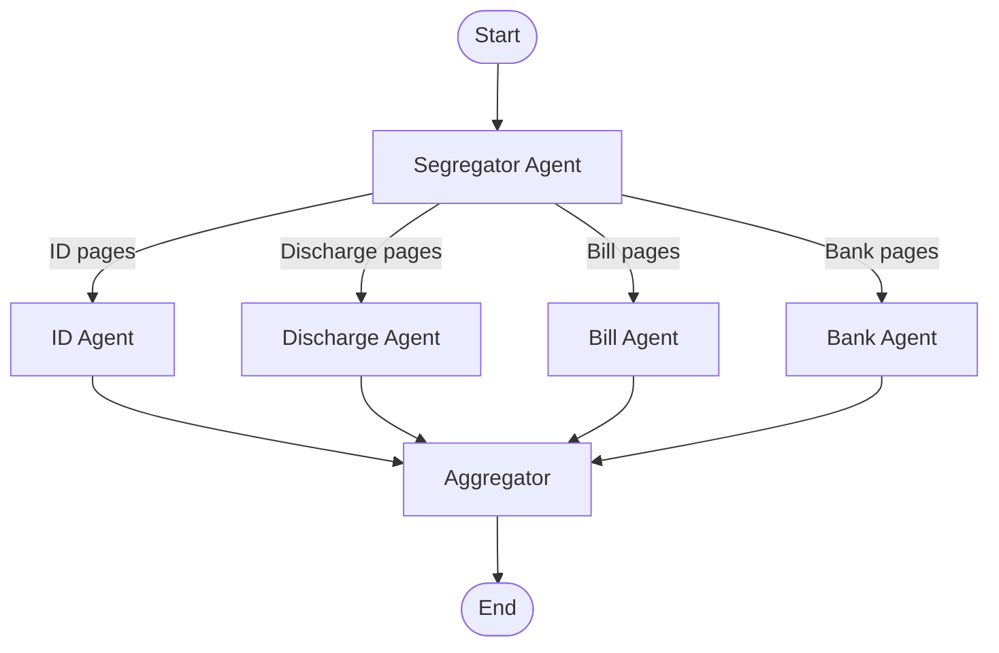
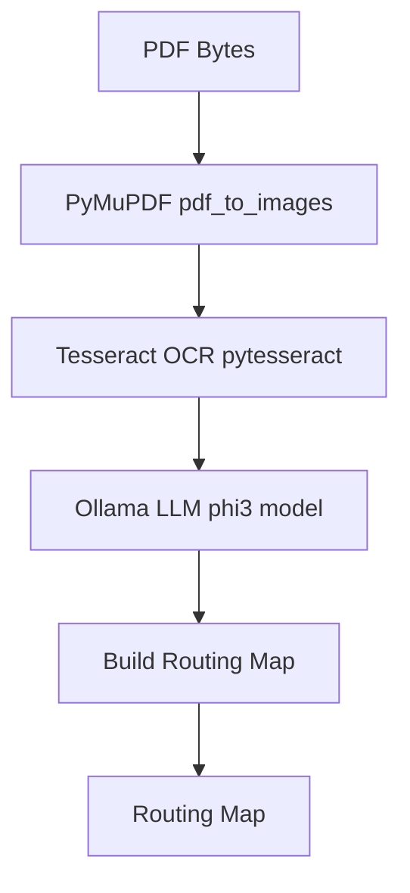
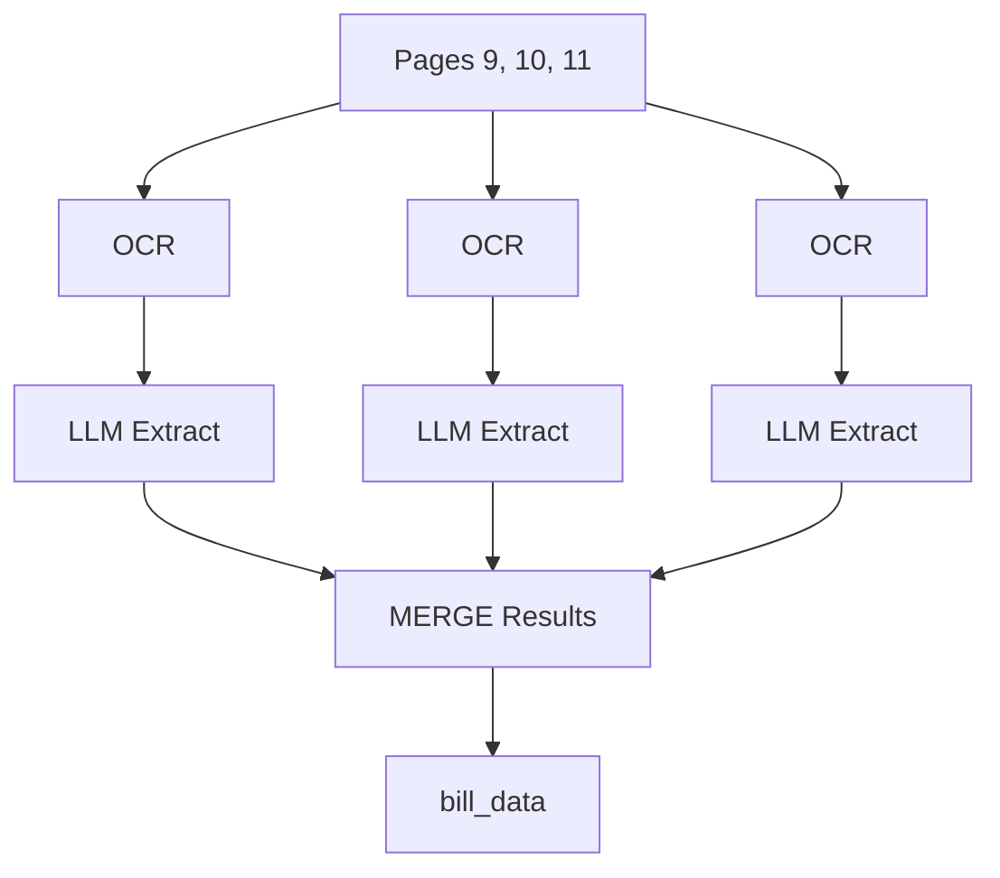
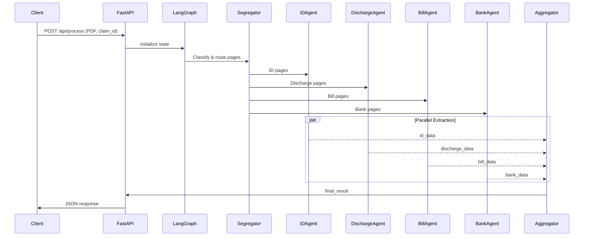

# Medical Claim Processing Pipeline

**Automated, privacy-first extraction of structured data from medical claim PDFs using multi-agent orchestration and local LLMs.**

A production-ready FastAPI service that processes medical claim PDFs using **LangGraph** multi-agent orchestration and local **Ollama** LLMs. The system classifies document pages, routes them to specialized extraction agents, and returns structured JSON data.

---

## Table of Contents

- [Overview](#overview)
- [Architecture](#architecture)
- [LangGraph Workflow](#langgraph-workflow)
- [Agent Deep Dive](#agent-deep-dive)
  - [Segregator Agent](#1-segregator-agent)
  - [ID Agent](#2-id-agent)
  - [Discharge Agent](#3-discharge-agent)
  - [Bill Agent](#4-bill-agent)
  - [Bank Agent](#5-bank-agent)
  - [Aggregator](#6-aggregator)
- [Complete Process Flow](#complete-process-flow)
- [Project Structure](#project-structure)
- [Installation Guide](#installation-guide)
  - [Prerequisites](#prerequisites)
  - [macOS Installation](#macos-installation)
  - [Windows Installation](#windows-installation)
  - [Linux Installation](#linux-installation)
- [Running the Application](#running-the-application)
- [Quick Test with Sample PDF](#quick-test-with-sample-pdf)
- [API Usage](#api-usage)
- [Example Response](#example-response)
- [Configuration](#configuration)
- [Tech Stack](#tech-stack)
- [Troubleshooting](#troubleshooting)

---

## Overview

This pipeline solves a common healthcare problem: extracting structured data from unstructured medical claim documents. A single claim PDF may contain multiple document types (ID cards, hospital bills, discharge summaries, etc.) mixed together across many pages.

**Key Features:**

- Automatic page classification into 9 document categories
- Parallel processing with specialized extraction agents
- Local LLM inference (no cloud API costs, data stays private)
- OCR-based text extraction using Tesseract
- RESTful API with Swagger documentation

---

## Architecture



**Key Points:**

- Pages are classified and routed to specialized agents in parallel.
- All results are aggregated into a single structured JSON response.

---

## LangGraph Workflow

LangGraph defines the workflow as a **directed graph**:



**Nodes:** Agent functions that process/transform state.  
**Edges:** Execution flow between agents.  
**State:** Shared data structure passed between nodes.

### State Schema (ClaimState)

The shared state object that flows through the entire graph:

```python
class ClaimState(TypedDict):
    claim_id:             str     # Unique claim identifier
    pdf_bytes:            bytes   # Raw PDF file content
    page_images:          dict    # {"page_1": "base64...", "page_2": "base64..."}
    page_classifications: dict    # {"page_1": "identity_document", "page_2": "itemized_bill"}
    routing:              dict    # {"identity_document": [1], "itemized_bill": [2,3,4]}
    id_data:              dict    # Extracted identity information
    discharge_data:       dict    # Extracted discharge summary
    bill_data:            dict    # Extracted billing data
    bank_data:            dict    # Extracted bank/cheque details
    final_result:         dict    # Combined output from aggregator
```

**Parallel Execution:**
After classification, all extraction agents run **in parallel** for maximum speed.

---

## Agent Deep Dive

### 1. Segregator Agent

**Location:** `agents/segregator.py`  
**Purpose:** Classifies every page and routes them to the right specialist.

**How it works:**



**Supported Document Types (9 categories):**

| Category                 | Description                          |
| ------------------------ | ------------------------------------ |
| `claim_forms`            | Insurance claim application forms    |
| `cheque_or_bank_details` | Bank account info, cancelled cheques |
| `identity_document`      | Government ID, patient ID cards      |
| `itemized_bill`          | Hospital bills with line items       |
| `discharge_summary`      | Medical discharge summaries          |
| `prescription`           | Doctor prescriptions                 |
| `investigation_report`   | Lab results, diagnostic reports      |
| `cash_receipt`           | Payment receipts                     |
| `other`                  | Unclassified documents               |

**Special Routing Rules:**

1. Only the first `identity_document` and `cheque_or_bank_details` page is kept; extras go to `other`.
2. Extra discharge pages are routed to `investigation_report`.
3. `cash_receipt` pages are merged with the Bill Agent.

---

### 2. ID Agent

**Location:** `agents/id_agent.py`

**Purpose:** Extracts patient identity information from ID cards and documents.

**Input:** Only pages classified as `identity_document`

**Extraction Fields:**

```json
{
	"patient_name": "John Michael Smith",
	"date_of_birth": "15/03/1985",
	"id_number": "ID-987-654-321",
	"policy_number": "POL-2025-12345",
	"gender": "Male",
	"blood_group": "O+",
	"address": "456 Oak Street, Springfield",
	"contact_number": "+1-555-0123",
	"email": "john.smith@email.com"
}
```

**Processing Flow:**
Pages [3] → Fetch images → OCR text → LLM extraction → id_data

---

### 3. Discharge Agent

**Location:** `agents/discharge_agent.py`

**Purpose:** Extracts medical information from hospital discharge summaries.

**Input:** Only pages classified as `discharge_summary`

**Extraction Fields:**

```json
{
	"patient_name": "John Michael Smith",
	"mrn": "MRN-2025-789",
	"date_of_birth": "15/03/1985",
	"admission_date": "20/01/2025",
	"discharge_date": "25/01/2025",
	"attending_physician": "Dr. Sarah Johnson, MD",
	"admission_diagnosis": "Community Acquired Pneumonia",
	"discharge_diagnosis": "Resolved Pneumonia",
	"condition_at_discharge": "Stable",
	"procedures_performed": "Chest X-ray, IV Antibiotics",
	"discharge_medications": "Amoxicillin 500mg, Ibuprofen 400mg"
}
```

---

### 4. Bill Agent

**Location:** `agents/bill_agent.py`

**Purpose:** Extracts itemized billing data including individual line items.

**Input:** Pages classified as `itemized_bill` (includes merged `cash_receipt` pages)

**Key Difference:** Unlike other agents, the Bill Agent processes **each page individually** then merges results. This handles multi-page bills with continuation items.

**Extraction Flow:**



**Output Structure:**

```json
{
	"patient_name": "John Michael Smith",
	"facility_name": "City General Hospital",
	"bills": [
		{
			"bill_number": "INV-001",
			"bill_date": "25/01/2025",
			"total_amount": 5000.0,
			"source_page": "page_9"
		},
		{
			"bill_number": "INV-002",
			"bill_date": "25/01/2025",
			"total_amount": 1418.65,
			"source_page": "page_10"
		}
	],
	"items": [
		{
			"description": "Room Charges (5 days)",
			"quantity": 5,
			"rate": 500.0,
			"amount": 2500.0,
			"source_page": "page_9"
		},
		{
			"description": "IV Antibiotics",
			"quantity": 10,
			"rate": 50.0,
			"amount": 500.0,
			"source_page": "page_9"
		},
		{
			"description": "Pharmacy Items",
			"quantity": 1,
			"rate": 418.65,
			"amount": 418.65,
			"source_page": "page_10"
		}
	],
	"total_amount": 6418.65,
	"page_totals": [
		{ "page": "page_9", "amount": 5000.0 },
		{ "page": "page_10", "amount": 1418.65 }
	]
}
```

---

### 5. Bank Agent

**Location:** `agents/bank_agent.py`

**Purpose:** Extracts bank account and cheque details for claim reimbursement.

**Input:** Only pages classified as `cheque_or_bank_details`

**Extraction Fields:**

```json
{
	"account_holder_name": "John Michael Smith",
	"bank_name": "State Bank of India",
	"account_number": "1234567890",
	"account_type": "savings",
	"ifsc_code": "SBIN0001234",
	"swift_code": "SBININBB",
	"branch_name": "Springfield Main Branch",
	"cheque_number": "000123",
	"cheque_date": "25/01/2025",
	"payee": "City General Hospital",
	"cheque_amount": 1283.73
}
```

---

### 6. Aggregator

**Location:** `workflow.py` (inline function)

**Purpose:** Combines outputs from all extraction agents into the final response.

**Process:**
All agent outputs are combined into a single final_result dictionary for the API response.

---

## Complete Process Flow

Here's the end-to-end journey of a claim PDF through the system:



---

## Project Structure

```
claim-pipeline/
│
├── main.py                    # FastAPI application entry point
│                              # - Defines /api/process endpoint
│                              # - Validates PDF uploads
│                              # - Invokes LangGraph workflow
│
├── workflow.py                # LangGraph state machine definition
│                              # - Defines ClaimState schema
│                              # - Wires agents into graph
│                              # - Contains Aggregator logic
│
├── agents/
│   ├── __init__.py
│   ├── segregator.py          # Page classification agent
│   ├── id_agent.py            # Identity extraction agent
│   ├── discharge_agent.py     # Discharge summary agent
│   ├── bill_agent.py          # Itemized bill agent
│   └── bank_agent.py          # Bank details agent
│
├── utils/
│   ├── __init__.py
│   ├── pdf_utils.py           # PDF to image conversion (PyMuPDF)
│   ├── ocr_client.py          # Tesseract OCR wrapper
│   ├── ollama_client.py       # Ollama API client (chat, vision)
│   └── model_output.py        # JSON parsing utilities
│
├── tests/                     # Test files
│
├── requirements.txt           # Python dependencies
├── .env                       # Environment configuration
├── .gitignore
└── README.md                  # This file
```

---

## Installation Guide

### Prerequisites

Before installing, ensure you have:

| Requirement   | Version | Purpose                     |
| ------------- | ------- | --------------------------- |
| Python        | 3.10+   | Runtime environment         |
| Ollama        | Latest  | Local LLM inference         |
| Tesseract OCR | 4.0+    | Text extraction from images |

---

### macOS Installation

#### Step 1: Install Homebrew (if not installed)

```bash
/bin/bash -c "$(curl -fsSL https://raw.githubusercontent.com/Homebrew/install/HEAD/install.sh)"
```

#### Step 2: Install Tesseract OCR

```bash
brew install tesseract
```

Verify installation:

```bash
tesseract --version
# Should show: tesseract 5.x.x
```

#### Step 3: Install Ollama

```bash
brew install ollama
```

Or download from: https://ollama.com/download/mac

#### Step 4: Pull the LLM model

```bash
ollama pull phi3:latest
```

#### Step 5: Start Ollama server

```bash
ollama serve
```

Keep this terminal open, or run in background.

#### Step 6: Clone and setup the project

```bash
# Clone the repository
git clone https://github.com/yourusername/claim-pipeline.git
cd claim-pipeline

# Create virtual environment
python3 -m venv venv

# Activate virtual environment
source venv/bin/activate

# Install dependencies
pip install -r requirements.txt
```

#### Step 7: Configure environment

```bash
# Create .env file
cat > .env << EOF
OLLAMA_HOST=http://127.0.0.1:11434
OLLAMA_MODEL=phi3:latest
OLLAMA_REQUEST_TIMEOUT_SECONDS=180
EOF
```

---

### Windows Installation

#### Step 1: Install Python 3.10+

Download from: https://www.python.org/downloads/windows/

**Important:** Check "Add Python to PATH" during installation.

#### Step 2: Install Tesseract OCR

1. Download installer from: https://github.com/UB-Mannheim/tesseract/wiki
2. Run the installer (use default settings)
3. Add Tesseract to PATH:
   - Default location: `C:\Program Files\Tesseract-OCR`
   - Add to System Environment Variables → Path

Verify in Command Prompt:

```cmd
tesseract --version
```

#### Step 3: Install Ollama

Download from: https://ollama.com/download/windows

Run the installer and follow prompts.

#### Step 4: Pull the LLM model

Open Command Prompt:

```cmd
ollama pull phi3:latest
```

#### Step 5: Start Ollama server

```cmd
ollama serve
```

Keep this window open.

#### Step 6: Clone and setup the project

Open a new Command Prompt:

```cmd
# Clone the repository
git clone https://github.com/yourusername/claim-pipeline.git
cd claim-pipeline

# Create virtual environment
python -m venv venv

# Activate virtual environment
venv\Scripts\activate

# Install dependencies
pip install -r requirements.txt
```

#### Step 7: Configure environment

Create a `.env` file in the project root with:

```
OLLAMA_HOST=http://127.0.0.1:11434
OLLAMA_MODEL=phi3:latest
OLLAMA_REQUEST_TIMEOUT_SECONDS=180
```

---

### Linux Installation

#### Ubuntu/Debian

```bash
# Update package list
sudo apt update

# Install Python and pip
sudo apt install python3 python3-pip python3-venv

# Install Tesseract OCR
sudo apt install tesseract-ocr

# Verify Tesseract
tesseract --version
```

#### Fedora/RHEL

```bash
sudo dnf install python3 python3-pip tesseract
```

#### Arch Linux

```bash
sudo pacman -S python python-pip tesseract
```

#### Install Ollama (all distributions)

```bash
curl -fsSL https://ollama.com/install.sh | sh
```

#### Pull model and start server

```bash
# Pull the model
ollama pull phi3:latest

# Start server (in background)
ollama serve &
```

#### Clone and Setup

````bash
# Clone the repository
git clone https://github.com/karthikpagnis/PolicyPilot.git

# Move into the project directory
cd PolicyPilot

# Create a Python virtual environment (recommended)
python3 -m venv venv

# Activate the virtual environment
# On macOS/Linux:
source venv/bin/activate
# On Windows:
venv\Scripts\activate

# Install dependencies
pip install -r requirements.txt

# Configure environment variables
# Create a .env file in the project root with the following content:

## On macOS/Linux:
```bash
cat > .env << EOF
OLLAMA_HOST=http://127.0.0.1:11434
OLLAMA_MODEL=phi3:latest
OLLAMA_REQUEST_TIMEOUT_SECONDS=180
EOF
````

## On Windows:

Open Notepad or any text editor, paste the following lines, and save as `.env` in your project folder:

```
OLLAMA_HOST=http://127.0.0.1:11434
OLLAMA_MODEL=phi3:latest
OLLAMA_REQUEST_TIMEOUT_SECONDS=180
```

````

---

## Running the Application

### Start the server

Make sure Ollama is running first, then:

```bash
# Activate virtual environment (if not already)
# macOS/Linux:
source venv/bin/activate
# Windows:
venv\Scripts\activate


# Start FastAPI server
uvicorn main:app --reload
````

You should see:

```
Ollama ready at http://127.0.0.1:11434 with model 'phi3:latest'
INFO:     Uvicorn running on http://127.0.0.1:8000 (Press CTRL+C to quit)
```

---

## Quick Test with Sample PDF

A sample medical claim PDF (`final.pdf`) is included in the repository for testing. After starting the server, you can immediately test the pipeline:

### Using curl

```bash
curl -X POST http://localhost:8000/api/process \
  -F "claim_id=TEST-001" \
  -F "file=@final.pdf"
```

### Using Python

```python
import requests

response = requests.post(
    "http://localhost:8000/api/process",
    files={"file": open("final.pdf", "rb")},
    data={"claim_id": "TEST-001"}
)
print(response.json())
```

---

## API Usage

### Interactive Documentation (Swagger UI)

After starting the FastAPI server, open your browser and navigate to:

```
http://localhost:8000/docs
```

This provides a visual interface to test the API.

**Note:**

- The default port is `8000` (as shown in the server startup message).
- If you run FastAPI with a different port (e.g., `uvicorn main:app --port 9000`), use `http://localhost:9000/docs` instead.

### Using curl

```bash
curl -X POST http://localhost:8000/api/process \
  -F "claim_id=CLM-2025-001" \
  -F "file=@/path/to/medical_claim.pdf"
```

### Using Python requests

```python
import requests

url = "http://localhost:8000/api/process"
files = {"file": open("medical_claim.pdf", "rb")}
data = {"claim_id": "CLM-2025-001"}

response = requests.post(url, files=files, data=data)
print(response.json())
```

### Health Check

```bash
curl http://localhost:8000/
```

Response:

```json
{
	"status": "running",
	"message": "Claim Processing API is live!",
	"usage": "POST /api/process with claim_id (string) and file (PDF)"
}
```

---

## Example Response

```json
{
	"claim_id": "CLM-2025-001",
	"total_pages_processed": 18,
	"page_classifications": {
		"page_1": "claim_forms",
		"page_2": "cheque_or_bank_details",
		"page_3": "identity_document",
		"page_4": "discharge_summary",
		"page_5": "investigation_report",
		"page_6": "investigation_report",
		"page_7": "investigation_report",
		"page_8": "investigation_report",
		"page_9": "itemized_bill",
		"page_10": "itemized_bill",
		"page_11": "itemized_bill",
		"page_12": "prescription",
		"page_13": "other",
		"page_14": "other",
		"page_15": "other",
		"page_16": "other",
		"page_17": "other",
		"page_18": "other"
	},
	"extracted_data": {
		"identity": {
			"patient_name": "John Michael Smith",
			"date_of_birth": "15/03/1985",
			"id_number": "ID-987-654-321",
			"gender": "Male",
			"blood_group": "O+",
			"address": "456 Oak Street, Apt 12B, Springfield, IL 62701"
		},
		"discharge_summary": {
			"patient_name": "John Michael Smith",
			"mrn": "MRN-2025-789456",
			"admission_date": "20/01/2025",
			"discharge_date": "25/01/2025",
			"attending_physician": "Dr. Sarah Johnson, MD",
			"admission_diagnosis": "Community Acquired Pneumonia (CAP)",
			"discharge_diagnosis": "Resolved Pneumonia - Full Recovery",
			"condition_at_discharge": "Stable, afebrile",
			"procedures_performed": "Chest X-ray, IV Antibiotics, Nebulization",
			"discharge_medications": "Amoxicillin 500mg TID, Ibuprofen 400mg PRN"
		},
		"itemized_bill": {
			"patient_name": "John Michael Smith",
			"facility_name": "City General Hospital",
			"bills": [
				{
					"bill_number": "BILL-2025-789456",
					"bill_date": "25/01/2025",
					"total_amount": 5000.0,
					"source_page": "page_9"
				},
				{
					"bill_number": "BILL-2025-789457",
					"bill_date": "25/01/2025",
					"total_amount": 1418.65,
					"source_page": "page_10"
				}
			],
			"items": [
				{
					"description": "Room Charges - Semi-Private (5 days)",
					"quantity": 5,
					"rate": 500.0,
					"amount": 2500.0,
					"source_page": "page_9"
				},
				{
					"description": "IV Antibiotics - Ceftriaxone",
					"quantity": 10,
					"rate": 150.0,
					"amount": 1500.0,
					"source_page": "page_9"
				},
				{
					"description": "Nursing Care",
					"quantity": 5,
					"rate": 200.0,
					"amount": 1000.0,
					"source_page": "page_9"
				},
				{
					"description": "Pharmacy - Discharge Medications",
					"quantity": 1,
					"rate": 418.65,
					"amount": 418.65,
					"source_page": "page_10"
				}
			],
			"total_amount": 6418.65,
			"page_totals": [
				{ "page": "page_9", "amount": 5000.0 },
				{ "page": "page_10", "amount": 1418.65 }
			],
			"payment_method": "insurance"
		},
		"cheque_or_bank_details": {
			"account_holder_name": "John Michael Smith",
			"bank_name": "State Bank",
			"account_number": "98765432100",
			"account_type": "savings",
			"ifsc_code": "SBIN0001234",
			"branch_name": "Springfield Main"
		}
	}
}
```

---

## Configuration

### Environment Variables

| Variable                         | Default                  | Description                    |
| -------------------------------- | ------------------------ | ------------------------------ |
| `OLLAMA_HOST`                    | `http://127.0.0.1:11434` | Ollama server URL              |
| `OLLAMA_MODEL`                   | `phi3`                   | LLM model for text processing  |
| `OLLAMA_REQUEST_TIMEOUT_SECONDS` | `180`                    | Max wait time for LLM response |
| `OLLAMA_RETRY_ATTEMPTS`          | `5`                      | Number of retries on failure   |
| `OLLAMA_RETRY_BASE_SECONDS`      | `1`                      | Base delay between retries     |
| `OLLAMA_MAX_RETRY_WAIT_SECONDS`  | `2`                      | Maximum retry delay            |

### Example .env file

```env
OLLAMA_HOST=http://127.0.0.1:11434
OLLAMA_MODEL=phi3:latest
OLLAMA_REQUEST_TIMEOUT_SECONDS=180
OLLAMA_RETRY_ATTEMPTS=5
```

---

## Tech Stack

| Component            | Technology | Purpose                                 |
| -------------------- | ---------- | --------------------------------------- |
| **API Framework**    | FastAPI    | REST API with automatic OpenAPI docs    |
| **Workflow Engine**  | LangGraph  | Multi-agent state machine orchestration |
| **LLM Runtime**      | Ollama     | Local LLM inference (phi3 model)        |
| **OCR Engine**       | Tesseract  | Text extraction from images             |
| **PDF Processing**   | PyMuPDF    | PDF to image conversion                 |
| **Image Processing** | Pillow     | Image manipulation for OCR              |
| **Validation**       | Pydantic   | Request/response data validation        |

---

## Troubleshooting

### Common Issues

#### 1. "Ollama validation failed" on startup

**Cause:** Ollama server not running or model not installed.

**Fix:**

```bash
# Start Ollama
ollama serve

# In another terminal, pull the model
ollama pull phi3:latest
```

#### 2. "tesseract is not recognized" (Windows)

**Cause:** Tesseract not in system PATH.

**Fix:**

1. Find Tesseract installation (usually `C:\Program Files\Tesseract-OCR`)
2. Add to System Environment Variables → Path
3. Restart terminal/IDE

#### 3. OCR returns empty text

**Cause:** Low image quality or unsupported language.

**Fix:**

- Ensure PDF is not image-only with very low resolution
- Install additional Tesseract language packs if needed

#### 4. LLM returns malformed JSON

**Cause:** Model timeout or truncated response.

**Fix:**

- Increase `OLLAMA_REQUEST_TIMEOUT_SECONDS` in `.env`
- Ensure sufficient RAM (phi3 needs ~4GB)

#### 5. "Connection refused" to Ollama

**Cause:** Ollama server crashed or wrong host configured.

**Fix:**

```bash
# Check if Ollama is running
curl http://127.0.0.1:11434/api/tags

# If not, restart it
ollama serve
```

---

## License

MIT License - feel free to use this project for learning and development.

---

## Contributing

Contributions are welcome! Please feel free to submit a Pull Request.
